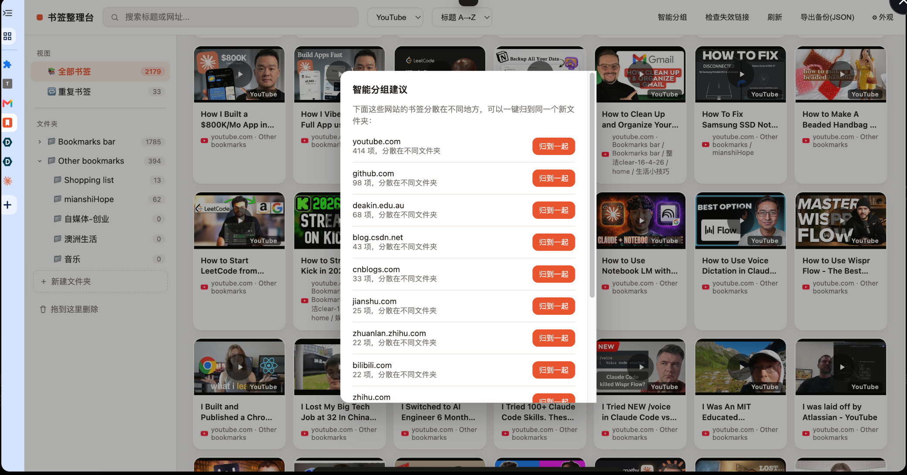
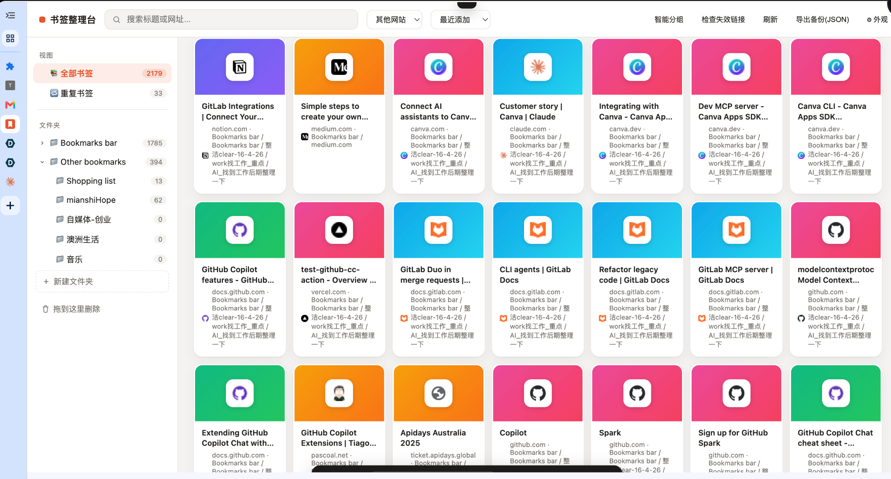

# 书签整理台 (Bookmark Organizer)

A Chrome new-tab extension that replaces the default new-tab page with a magazine-style card view of your bookmarks — YouTube thumbnail previews, multi-select + drag-and-drop into folders, and direct read/write access to your real Chrome bookmarks.

## Features

- Replaces the new-tab page with a card-based bookmark browser
- YouTube video thumbnails auto-preview
- Multi-select bookmarks and drag them into folders
- Search, filter by type (YouTube / other), and sort by date or title
- Card size options and dark mode
- Works directly on your real Chrome bookmarks — no external server, no account, no data leaves your browser

## Screenshots

**Grid overview** — all bookmarks as cards, sorted/filtered from the top bar

**YouTube thumbnails** — video bookmarks show their real thumbnail

**Smart grouping** — one-click suggestions to group bookmarks scattered across folders by domain

**Large cards + dark mode** — adjustable card size and theme

## Installation

This extension is not published on the Chrome Web Store — install it manually in developer mode:

1. Download or clone this repository
2. Open `chrome://extensions` in Chrome
3. Turn on **Developer mode** (top right)
4. Click **Load unpacked** and select this project's folder
5. Open a new tab — you should see the bookmark organizer

> Note: `newtab.html` must be loaded as an installed extension, not opened directly as a file — it needs the `chrome.bookmarks` API.

## Permissions

The extension only requests:
- `bookmarks` — to read and organize your Chrome bookmarks
- `favicon` — to show site icons on cards

No network requests are made and no data is collected or sent anywhere.

## License

MIT — see [LICENSE](LICENSE).
