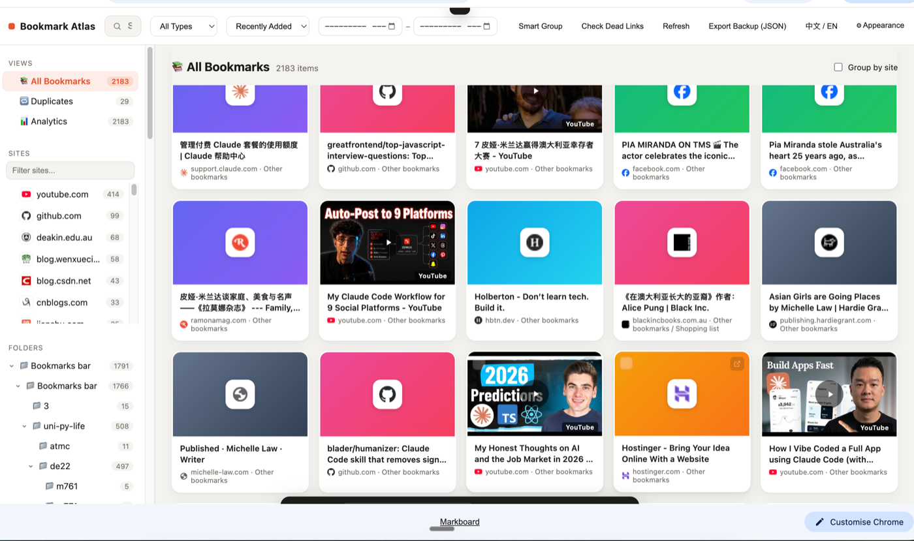
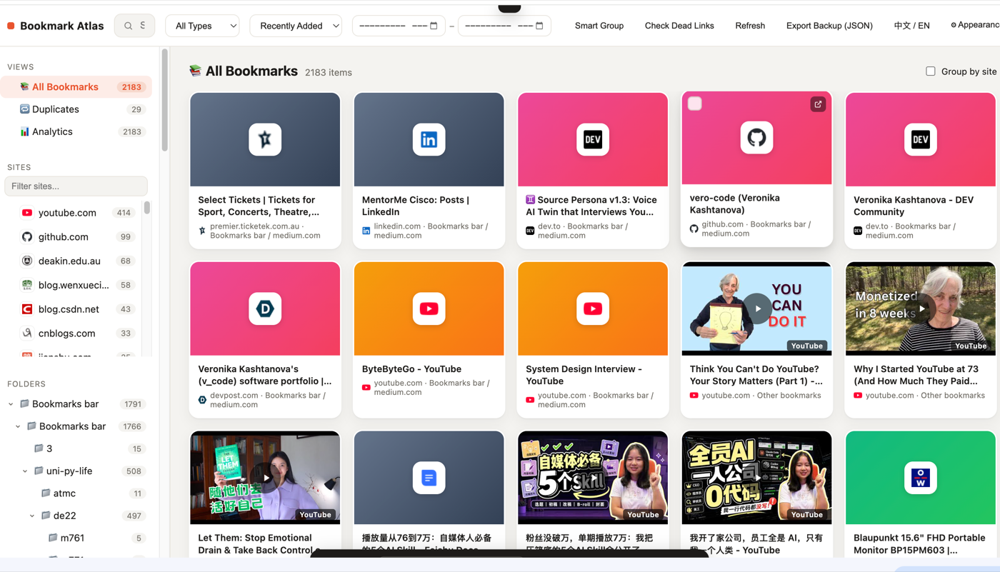
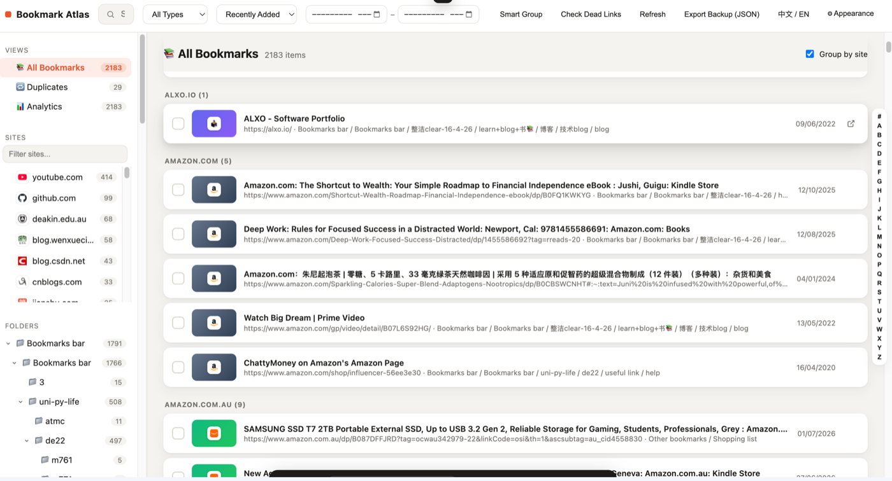
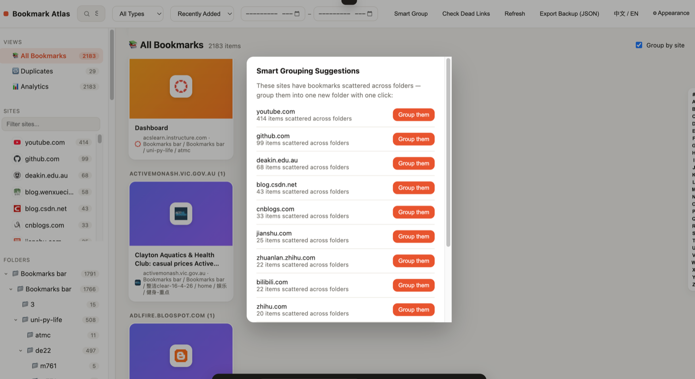
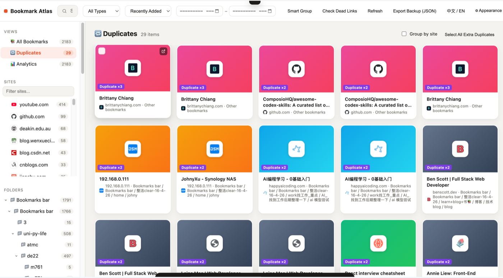
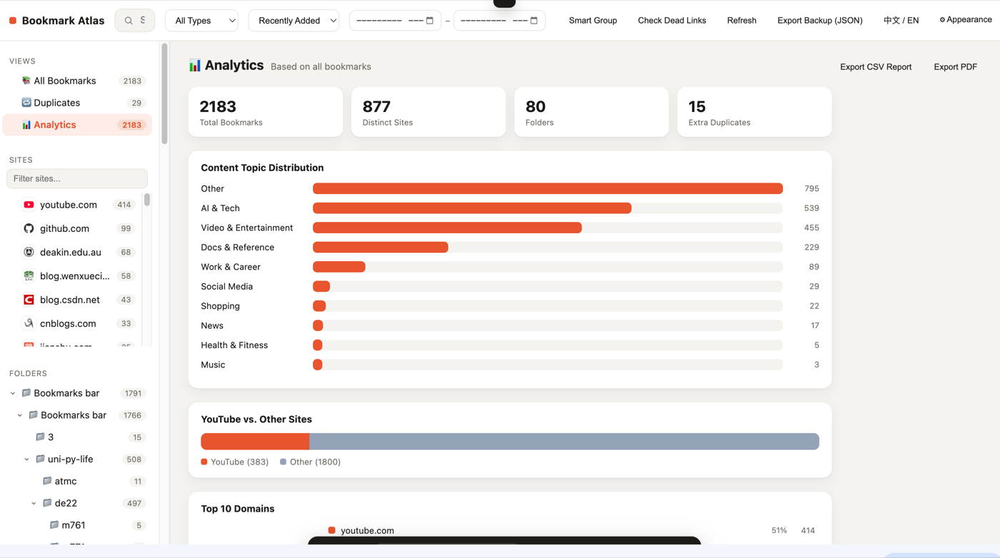
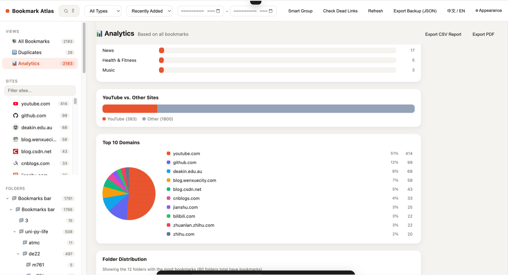
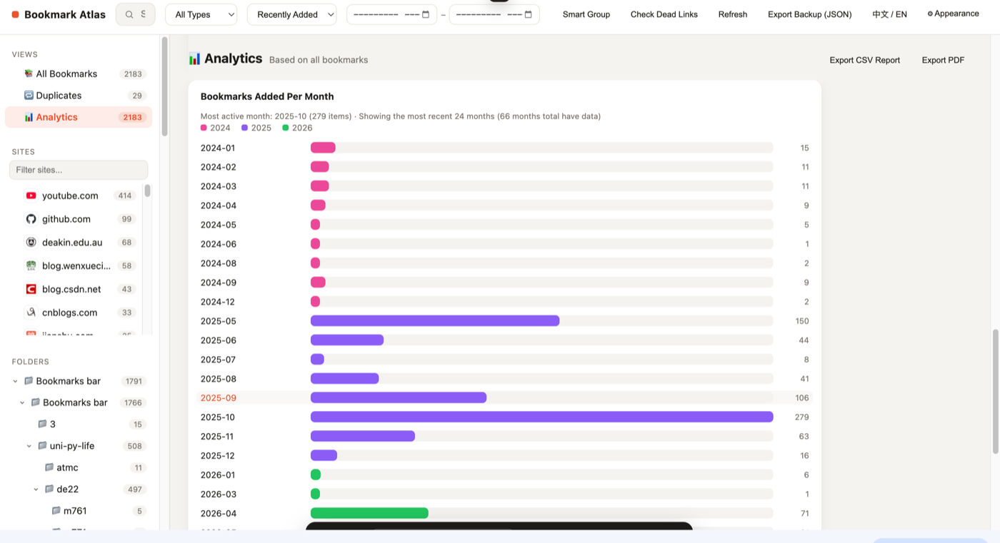
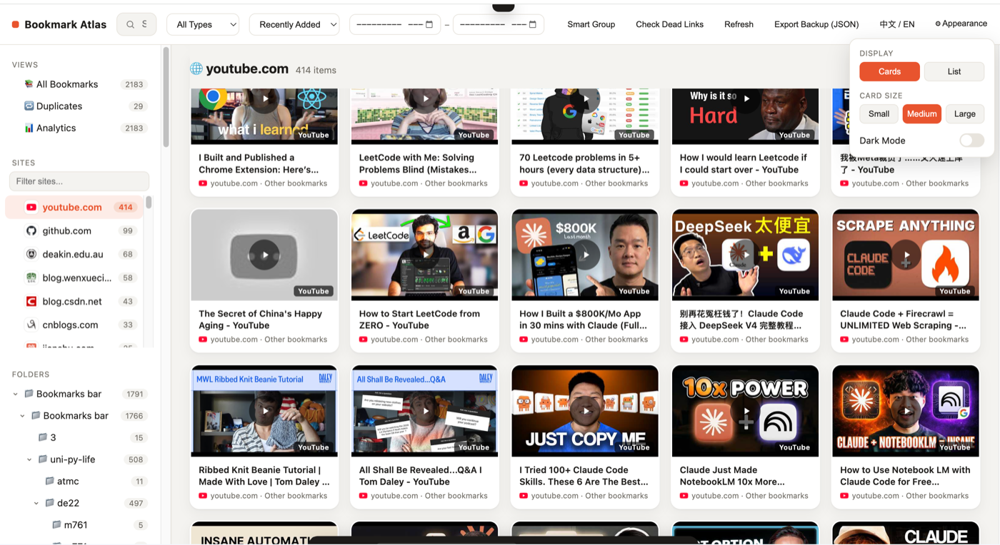

# Bookmark Atlas

**[English](README.md) | 中文**

*探索你的书签。*

一个 Chrome 新标签页扩展，把默认新标签页替换成杂志卡片式的书签管理界面——YouTube 视频缩略图预览、多选 + 拖拽把书签整理进文件夹，直接读写你真实的 Chrome 书签。

## 功能

- 用卡片式书签浏览器替换新标签页
- YouTube 视频书签自动显示缩略图预览
- 多选书签并拖拽到文件夹
- 支持搜索、按类型筛选（YouTube / 其他网站）、按日期或标题排序
- 卡片大小可调，支持深色模式
- 内置中文/English 语言切换（顶部工具栏）——扩展界面本身就是双语的，不只是这份 README
- 直接操作你真实的 Chrome 书签——没有外部服务器、不需要账号、数据不会离开你的浏览器

## 截图

**网格总览** — 所有书签以卡片形式展示，可在顶部筛选/排序

**YouTube 缩略图** — 视频类书签自动显示真实缩略图

**列表视图 + 按网站分组** — 可以自己勾选是否按域名分组

**智能分组** — 一键把分散在不同文件夹的同域名书签归到一起

**重复检测** — 自动找出重复书签（URL 归一化比较），一次性清理

**数据分析 — 总览** — 总数统计 + 内容主题分布

**数据分析 — 热门域名** — 你最常收藏的网站，饼图可点击跳转

**数据分析 — 按年/月趋势** — 书签是什么时候加进来的，一目了然

**外观设置** — 深色模式、卡片大小可调

## 安装方法

这个扩展没有上架 Chrome 网上应用店，需要手动以开发者模式加载：

1. 下载或克隆本仓库
2. 在 Chrome 打开 `chrome://extensions`
3. 打开右上角的 **开发者模式**
4. 点击 **加载已解压的扩展程序**，选择本项目文件夹
5. 打开一个新标签页，就能看到 Bookmark Atlas 了

> 注意：`newtab.html` 必须以扩展的方式加载，不能直接双击打开这个 HTML 文件——它需要用到 `chrome.bookmarks` 接口。

## 权限说明

这个扩展只申请了：
- `bookmarks` —— 读取和整理你的 Chrome 书签
- `favicon` —— 在卡片上显示网站图标

不会发起任何网络请求，也不会收集或上传任何数据。

## 许可证

MIT —— 见 [LICENSE](LICENSE)。
